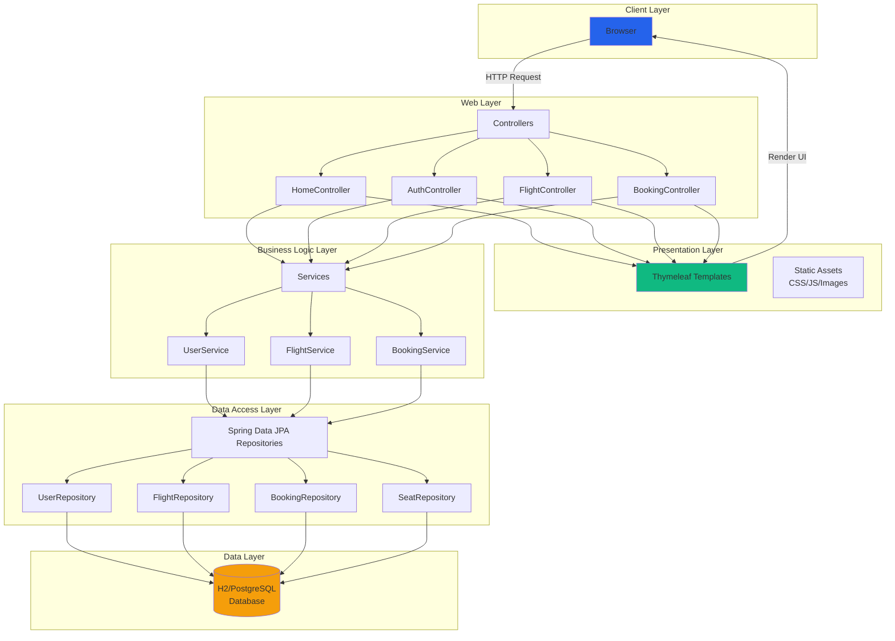
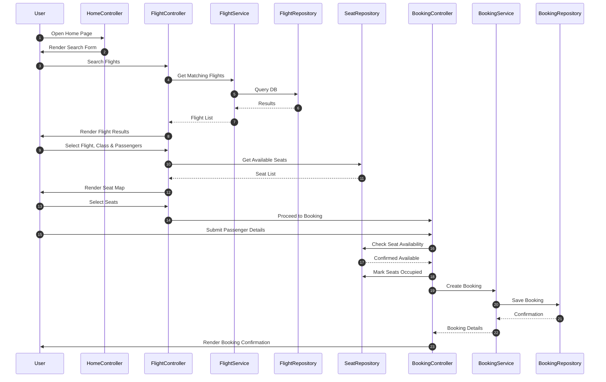
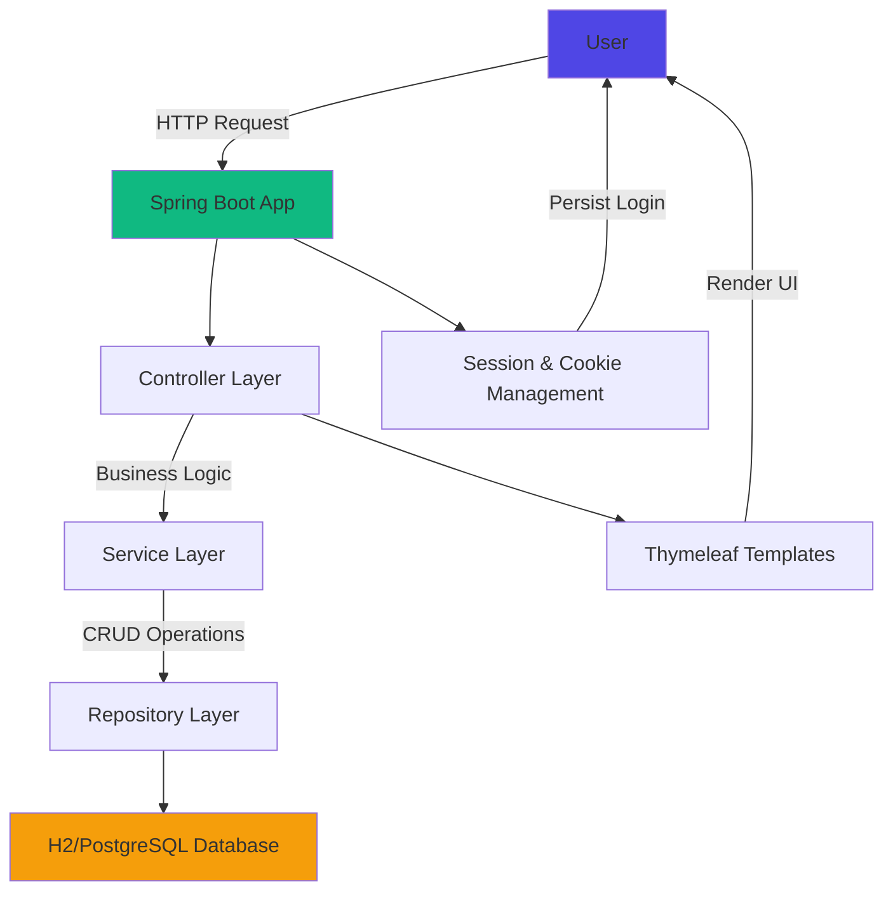

# ✈️ SkyWings Airlines Reservation System
A modern, feature-rich airline reservation management system built with Spring Boot, featuring a beautiful glassmorphism UI, real-time seat selection, and persistent user sessions.

## 📋 Table of Contents
- [Features](#-features)
- [System Design](#-system-design)
- [Tech Stack](#-tech-stack)
- [Installation & Setup](#-installation--setup)
- [Usage](#-usage)
- [API Endpoints](#-api-endpoints)
- [Database Schema](#-database-schema)
- [Contributing](#-contributing)
- [License](#-license)

## ✨ Features
- **User Authentication & Authorization**: Secure login and registration with password encoding
- **Remember Me**: Persistent session across app restarts using secure cookies
- **Flight Search & Management**: Browse and search flights by departure/arrival city and date
- **Interactive Seat Selection**: Visual seat map with availability status and class differentiation (Economy/Business)
- **City Autocomplete**: Typeahead search for departure/arrival cities
- **Booking Management**: View, confirm, and track your bookings
- **Responsive Design**: Beautiful glassmorphism UI that works on all devices
- **Persistent Storage**: File-based H2 database (switch to PostgreSQL for production)

## 🏗️ System Design
Here's a complete set of diagrams for the system:

### Architecture Overview (Detailed)


### Booking Workflow Diagram
The end-to-end process of booking a flight:



### CI/CD Pipeline Diagram
A modern pipeline for deploying to production:


### Simple Data Flow Diagram


### Architecture Layers
1. **Controller Layer**: Handles incoming HTTP requests
2. **Service Layer**: Implements business logic
3. **Repository Layer**: Data access using Spring Data JPA
4. **View Layer**: Thymeleaf templates for rendering dynamic HTML

### Data Flow for Booking
1. User searches for flights
2. System retrieves available flights with pricing
3. User selects flight, class, and seats
4. Real-time seat availability checked in database
5. Booking created and seats marked as occupied
6. Booking confirmation shown to user

## 🛠️ Tech Stack
- **Backend**: Java 17+, Spring Boot 3.2.x, Spring MVC, Spring Data JPA, Hibernate ORM
- **Frontend**: Thymeleaf, HTML5, CSS3, Vanilla JavaScript
- **Database**: H2 (file-based, for dev) / PostgreSQL (for production)
- **Build Tool**: Maven
- **UI Design**: Glassmorphism, custom animations, responsive grid layout
- **Other**: Lombok (optional), Jakarta Persistence API

## 📦 Installation & Setup

### Prerequisites
- Java 17 or higher installed
- Maven installed
- IDE (IntelliJ IDEA, Eclipse, or VS Code recommended)

### Step 1: Clone or Download the Project
If using Git (optional):
```bash
# git clone <your-repo-url>
cd "Airlines Reservation System Java Project"
```

### Step 2: Configure Application Properties
Copy the example properties file and configure your settings:
```bash
cp src/main/resources/application.example.properties src/main/resources/application.properties
```
Edit `application.properties` with your configuration (default settings work for local development).

### Step 3: Build the Project
```bash
mvn clean install
```

### Step 4: Run the Application
```bash
mvn spring-boot:run
```
The application will start on http://localhost:8081

### Step 5: Access the App
Open your browser and navigate to http://localhost:8081

## 🚀 Usage

1. **Register/Login**: Create a new account or login with existing credentials
2. **Search Flights**: Enter departure and arrival cities on the home page to search
3. **Select Flight**: Choose a flight from the available options
4. **Pick Seats**: Select your preferred seats on the interactive seat map
5. **Complete Booking**: Enter passenger details and confirm your booking
6. **Manage Bookings**: View and track all your bookings from the "My Bookings" page

## 📡 API Endpoints

| Method | Endpoint | Description |
|--------|----------|-------------|
| `GET` | `/` | Home page |
| `GET` | `/login` | Login page |
| `POST` | `/login` | Authenticate user |
| `GET` | `/register` | Registration page |
| `POST` | `/register` | Create new user |
| `GET` | `/flights` | List all flights / search flights |
| `GET` | `/seat-selection` | Show seat selection page |
| `POST` | `/booking` | Create new booking |
| `GET` | `/my-bookings` | View user bookings |
| `GET` | `/api/cities` | Get city suggestions (autocomplete) |
| `GET` | `/api/seats/{flightId}` | Get seats for a flight |

## 📊 Database Schema

### Users Table
| Column | Type | Description |
|--------|------|-------------|
| id | Long (PK) | Primary key |
| username | String | Unique username |
| password | String | Encrypted password |
| full_name | String | Full name |
| email | String | Email address |
| created_at | Timestamp | Creation date |

### Flights Table
| Column | Type | Description |
|--------|------|-------------|
| id | Long (PK) | Primary key |
| flight_number | String | Unique flight number |
| airline | String | Airline name |
| departure_city | String | Departure city |
| arrival_city | String | Arrival city |
| departure_time | LocalDateTime | Departure time |
| arrival_time | LocalDateTime | Arrival time |
| price_economy | BigDecimal | Economy class price |
| price_business | BigDecimal | Business class price |
| total_seats_economy | Integer | Total economy seats |
| total_seats_business | Integer | Total business seats |
| available_seats_economy | Integer | Available economy seats |
| available_seats_business | Integer | Available business seats |
| status | String | Flight status |

### Seats Table
| Column | Type | Description |
|--------|------|-------------|
| id | Long (PK) | Primary key |
| flight_id | Long (FK) | Flight reference |
| seat_number | String | Unique seat number per flight |
| seat_class | String | ECONOMY or BUSINESS |
| is_occupied | Boolean | Availability status |

### Bookings Table
| Column | Type | Description |
|--------|------|-------------|
| id | Long (PK) | Primary key |
| booking_reference | String | Unique booking ID |
| user_id | Long (FK) | User reference |
| flight_id | Long (FK) | Flight reference |
| booking_date | Timestamp | Booking creation date |
| total_amount | BigDecimal | Total booking amount |
| status | String | Booking status |

### Passengers Table
| Column | Type | Description |
|--------|------|-------------|
| id | Long (PK) | Primary key |
| booking_id | Long (FK) | Booking reference |
| full_name | String | Passenger full name |
| age | Integer | Passenger age |
| gender | String | Gender |
| seat_number | String | Assigned seat number |

## 🤝 Contributing
Contributions are welcome! Feel free to submit a Pull Request.

## � Initialize Git & Push to GitHub
Ready to share your project? Here's how to push to GitHub:

```bash
# 1. Initialize Git repository
git init

# 2. Add all files to staging
git add .

# 3. Create first commit
git commit -m "Initial commit: SkyWings Airlines Reservation System"

# 4. Create a new repo on GitHub, then link it (replace with your repo URL)
git remote add origin https://github.com/[your-username]/[your-repo-name].git

# 5. Push to main branch
git branch -M main
git push -u origin main
```

## �� License
This project is licensed under the MIT License.
